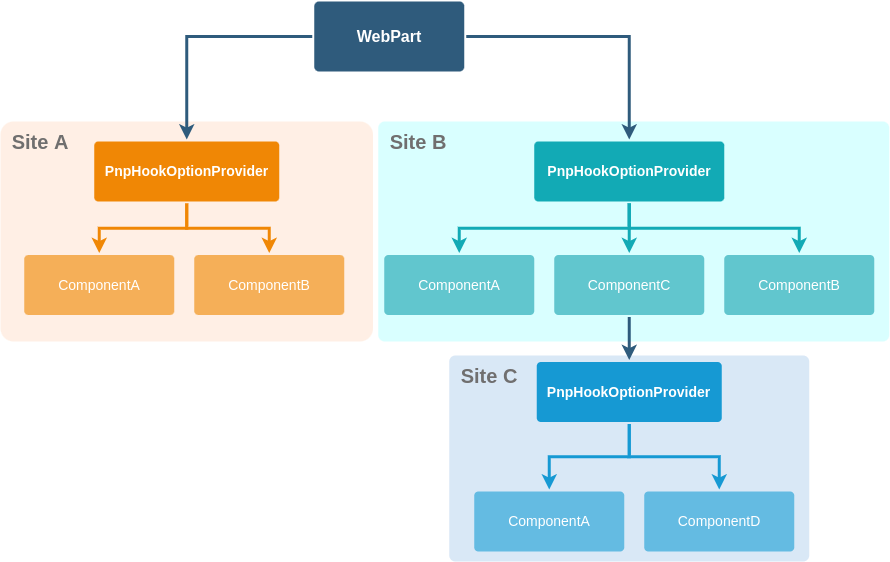

# Advanced

## Using dependency list parameter

All hooks supports custom dependency array similar to React's built-in hooks but unlike React, some parameters tracked internally and adding these parameters to array is not required. Hooks auto refreshes when any meaningful changes happened on parameters.

:::info

Auto tracked parameters are marked with `🚩` symbol on the [docs](API/index.md).

:::

```typescript
let title = "My List";

// myList refreshes when `title` and query changes.
const myList = useList(title, {
	query: {
		select: ["Title"]
	}
});

const unnecessary = useList(title, {
	query: {
		select: ["Title"]
	}
}, [title]); // passing title and query is not required. They are already tracked internally.

let refresh = {};

const forcedRefresh = useList(title, {
	query: {
		select: ["Title"]
	}
}, [refresh]); // You can always force refresh with your custom variables.
```

## Behaviors

Hooks supports PnPJs v3 behaviors for both local and global scope.

**Global**
```typescript
export default class PnpReactHookExamplesWebPart extends BaseClientSideWebPart<IPnpReactHookExamplesWebPartProps>
{
  private _hookOptions: PnpHookGlobalOptions;

  protected onInit(): Promise<void>
  {
    return super.onInit().then(() =>
    {
	  // Simply initialize spfi with your custom behaviors
      const sp = spfi().using(SPFx(this.context), Caching(), MyCustomBehavior());

      // Create global options object.
      this._hookOptions = {
        sp: sp
      };
    });
  }
}
```

**Local**
```typescript
export default function useWhoAmI()
{
    const user = useCurrentUser({
		behaviors: [Caching(), MyCustomBehavior()]
	});

    // useProfile is not affected by Caching() and MyCustomBehavior()
	const profile = useProfile(user?.LoginName, {
		disabled: "auto"
	});

	return [user, profile];
}
```

:::info
The `behaviors` property doesn't override your global behavior configuration, it only appends behaviors to hook's inner queryable instance.
:::

## Configure for multiple sites

Multiple [`PnpHookOptionProvider`](API/PnpHookOptionProvider.md) can be created with different `spfi` context to access multiple sites. Also, each hook function has a `sp` option to override `spfi`.

```tsx
export default function WebPart()
{
    // Creating different zones and configurations with PnpHookOptionProvider element.
	return (
	<>
		{/* Site A */}
		<PnpHookOptionProvider value={{sp: spfi_siteA}}>
			<ComponentA />
			<ComponentB />
		</PnpHookOptionProvider>
		{/* Site B */}
		<PnpHookOptionProvider value={{sp: spfi_siteB, keepPreviousState: true}}>
			<ComponentA />
				{/* Site C */}
				<PnpHookOptionProvider value={{sp: spfi_siteC, disabled: "auto"}}>
					<ComponentA />
					<ComponentD />
				</PnpHookOptionProvider>);
			<ComponentB />
		</PnpHookOptionProvider>
	</>);
}
```



## Accessing options

Hook options are accessible via [`usePnpHookOptions`](API/usePnpHookOptions.md). This can be useful when creating derivative of options or accessing to `spfi`.

:::tip

PnP React hooks only provides functions to read data but you can access the underlying `spfi` context to interact with other PnPjs functions.

```tsx
import "@pnp/sp/lists";
import "@pnp/sp/items";
import { usePnpHookOptions } from "pnp-react-hooks;

function ExampleComponent()
{
	// get options from nearest parent provider.
	const options = usePnpHookOptions();

	const onClick = () =>
	{
		options?.sp.web.lists.getByTitle("My List").items
			.add({ Title: "New Item" })
			.then(console.log)
			.error(console.error);
	};

	return (<button onClick={onClick}>Add New Item</button>);
}
```

:::